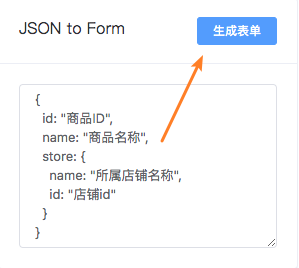
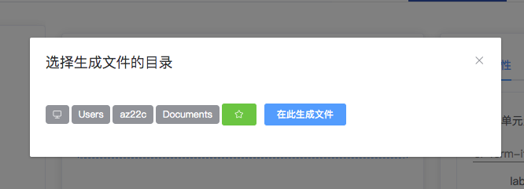

<h1 align="center">Welcome to element-checklist 👋</h1>
<p align="center">
  
   <a href="https://github.com/AlexZhong22c/element-checklist/blob/master/LICENSE">
    
  </a>
  <a href='https://travis-ci.org/AlexZhong22c/element-checklist' target="_blank" alt='travis ci'>
  
  </a>
</p>

> checklist工作流，快速创建 element-ui 组件并生成对应代码。
> 
> 思想：基于 element-ui，通过勾选和输入的UI交互来设置组件属性，利用checklist过一遍每一项，然后输出代码即可。
> 
> 特点：用于新建组件；标准化；控制代码质量

## 🏠 [Homepage](https://AlexZhong22c.github.io/element-checklist/)

## Install and Bootup

```sh
npm install -g element-checklist
e-checklist serve
# or give a try in a project:
npm install --save-dev element-checklist
# 同时开启前后端：(若后端未启动会导致前端启动失败)
npx e-checklist serve
```

## How to Use

### 表单

一份 elment-ui 表单(el-form)有2处需要编辑设置的地方：

- el-form本组件的属性。例如：
  - 表单对象名
  - 表单的 Ref 名（用于表单验证）
  - 等等
- 表单项(el-form-item)

通过左栏的操作，添加 表单项 到中栏，方式有2种：

- 一项项地点击添加
- 由JSON/对象转化(批量添加)

**由JSON/对象转化**：你可以对后端接口返回字段稍作修改，粘贴至 JSON 输入框中再一键生成，支持嵌套的格式。(可以是json格式，也可以是JS对象格式)



此处格式约定了是 `value:label` 这样的结构，value 也就是该el-form-item的字段名，label 作为el-form-item的 label 属性。

```javascript
{
  id: "商品ID",
  name: "商品名称",
  store: {
    name: "所属店铺名称",
    id: "店铺id"
  }
}
```

然后点击生成表单即可，默认生成 InputTrim 这类，可在右栏el-form-item的编辑区修改其类型。

### 表格

将后端接口返回字段粘贴至 JSON 输入框中，一键生成表格，然后编辑表格头等信息即可。

## 功能汇总

- 在线预览代码
- 如果npm install了，在本地启动该npm包内的后端可以把代码文件输出到本地(待优化)



- [x] 将后端JSON接口返回字段，稍作修改，粘贴生成出组件的代码框架
- [x] 用UI交互来取代代码的编写：明显比直接编辑器编写代码快
- [ ] 支持为组件标注注释：这样方便先写TODO来记住后续需要如何修改
- [ ] 支持admin前后端代码一起生成

模块方面：

- [x] 表单 el-form：组件属性、控件供选项的设置
  - [x] 支持表单校验的JS逻辑
  - [x] 支持表单文字提示和校验错误提示一起显示的HTML逻辑
- [x] 表格 el-table：组件属性
  - [ ] el-table组件本身属性的设置
  - [x] 支持表格字段HTML灵活转为template格式
  - [x] 支持判断表格字段是否为查询字段(待完善)
- [x] 在线代码编辑器
  - [x] 支持多开浏览器tab间同步代码结果

## Author

👤 **az22c**

- Github: [@AlexZhong22c](https://github.com/AlexZhong22c)

## Support

Give a ⭐️ if the project inspired you!
